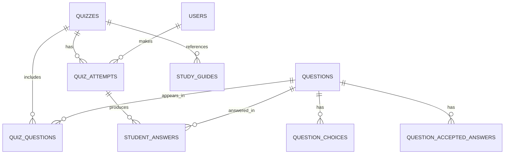
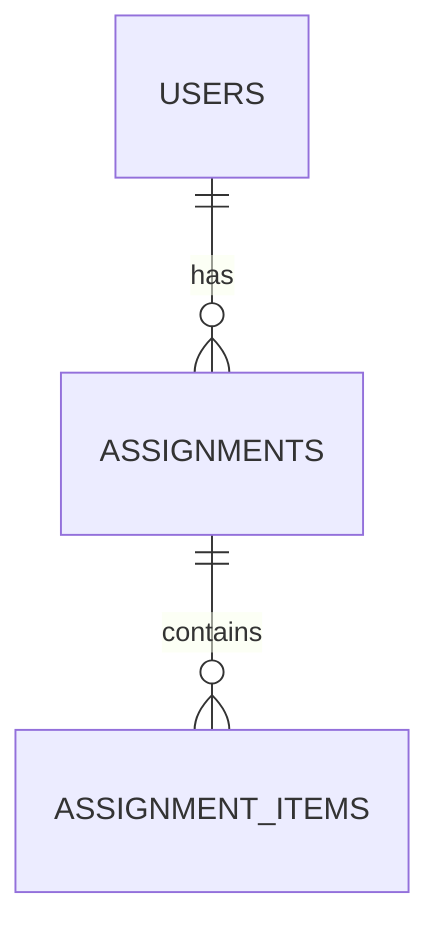
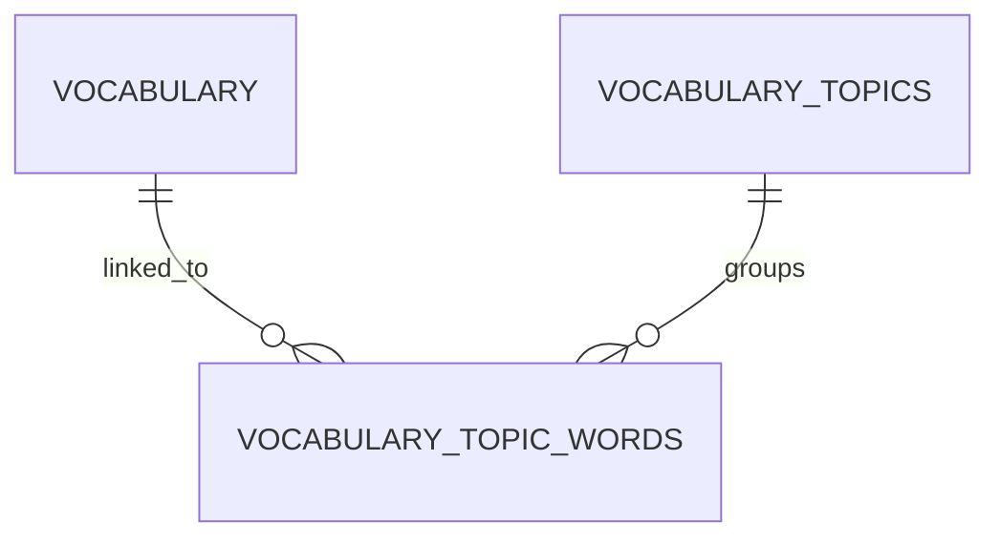
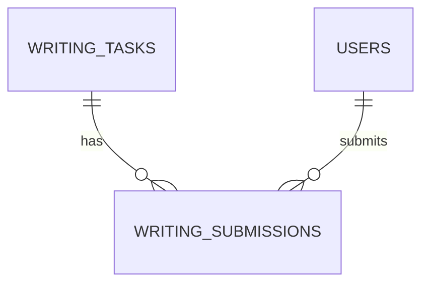

# English Student System

A full-stack English learning platform with a React frontend and a NestJS backend.

This system supports student learning workflows (reading, vocabulary, quizzes, writing) and teacher/admin workflows (content creation, management, and AI-assisted quiz generation).

## Overview

- **Frontend:** React 19 + TypeScript + Vite
- **Backend:** NestJS 11 + TypeScript + PostgreSQL via TypeORM
- **Background jobs:** BullMQ + Redis
- **AI quiz generation:** LangChain + Claude (Anthropic)
- **Audio:** ElevenLabs TTS + Supabase Storage (question audio files)
- **Auth:** JWT stored in HTTP-only cookies
- **Data fetching:** TanStack Query v5
- **Error monitoring:** Sentry (frontend + backend)
- **Email:** Nodemailer (Gmail service)

## Repository Structure

```text
english-student-system/
├─ backend/    # NestJS API
├─ frontend/   # React web app
└─ LICENSE
```

## Directory Deep Dive

### Backend (`backend/`)

- `src/` contains all NestJS domain modules.
- `src/config/` contains Sentry, Nodemailer, Redis, and Supabase client setup.
- `src/auth/` contains JWT authentication, guards, and decorators.
- `src/modules/` contains all feature modules. Each module follows a consistent structure: `entities/`, `repositories/`, `dto/`, controller, service, and module file.
- `src/db/views/` contains SQL view definitions that must be applied to the database once (e.g. `v_assignment_item_progress`).
- `certs/` contains an optional SSL certificate (`prod-ca-2021.crt`) for connecting to managed Postgres instances.

### Frontend (`frontend/`)

- `src/pages/` contains route-level screens: `Admin`, `Dashboard`, `Login`, `Practice`, `Quiz`, `QuizList`, `Reading`, `Register`, `Vocab`.
- `src/components/` contains feature UI components organized by domain: `admin/`, `quiz/`, `dashboard/`, `vocab/`, `reading/`, `practice/`, `layout/`, `auth/`, `register/`.
- `src/services/` contains API service wrappers and the shared Axios HTTP client (`http-client.service.ts`).
- `src/hooks/` contains TanStack Query hooks (`queries.ts`, `mutations.ts`).
- `src/contexts/` contains the `AuthContext` provider.
- `src/types/` contains shared TypeScript types organized by domain.
- `src/utils/` contains small utility helpers (`isUuid.ts`, `progress.ts`).

## Data Model

### Entities

All database entities are TypeORM classes with `@Entity` decorators. The `synchronize` option is disabled — schema changes are applied manually.

| Entity | Table | Key Columns |
|---|---|---|
| `User` | `users` | `id`, `name`, `email`, `password`, `role`, `teacherId`, `isApproved` |
| `Assignment` | `assignments` | `id`, `userId`, `title`, `description`, `dueDate`, `isCompleted` |
| `AssignmentItem` | `assignment_items` | `id`, `assignmentId`, `contentType`, `contentId`, `isCompleted` |
| `Quiz` | `quizzes` | `id`, `title`, `description` |
| `Question` | `questions` | `id`, `question`, `questionType`, `hints` |
| `QuizQuestion` | `quiz_questions` | `id`, `quizId`, `questionId`, `maxPoints`, `orderIndex` |
| `QuestionChoice` | `question_choices` | `id`, `questionId`, `optionText`, `isCorrect` |
| `QuestionAcceptedAnswer` | `question_accepted_answers` | `id`, `questionId`, `answer`, `blankIndex` |
| `QuizAttempt` | `quiz_attempts` | `id`, `quizId`, `userId`, `points`, `startedAt`, `completedAt` |
| `StudentAnswer` | `student_answers` | `id`, `attemptId`, `questionId`, `selectedOptionId`, `textAnswer`, `blankIndex`, `points` |
| `StudyGuide` | `study_guides` | `id`, `topic`, `explanation` |
| `Text` | `texts` | `id`, `title`, `content`, `level` |
| `WritingTask` | `writing_tasks` | `id`, `title`, `instructions`, `minWords` |
| `WritingSubmission` | `writing_submissions` | `id`, `taskId`, `userId`, `content`, `feedback`, `score`, `submittedAt`, `reviewedAt` |
| `Vocabulary` | `vocabulary` | `id`, `word`, `meaning`, `example`, `translation` |
| `VocabularyTopic` | `vocabulary_topics` | `id`, `topic`, `description` |
| `VocabularyTopicWord` | `vocabulary_topic_words` | `id`, `vocabularyId`, `topicId` |
| `AiDraft` | `ai_drafts` | `id`, `model`, `draft`, `draftType`, `isApproved`, `additionalInstructions` |

### Domain Relationships

#### Quiz System



#### Assignments System



`AssignmentItem` uses a polymorphic pattern: `contentType` (e.g. `'quiz'`, `'text'`, `'writing'`, `'vocabulary'`) + `contentId` (UUID of the referenced entity). Both `Assignments` and `AssignmentItems` use an `isCompleted` boolean column instead of a status column.

#### Vocabulary System



#### Writing System



### Database Views

`v_assignment_item_progress` — a reusable view that counts completed vs. total items per assignment and content type. Referenced by the dashboard and email notification queries. Must be applied to the database once via the SQL file at `backend/src/db/views/v_assignment_item_progress.sql`.

## Custom Repositories

The backend replaces the old raw `pg` pool service with TypeORM. Complex queries that cannot be expressed cleanly with the TypeORM query builder are embedded directly in custom repository classes as inline SQL strings. These repositories extend `Repository<Entity>` (from TypeORM) or wrap `DataSource` for queries that span multiple tables.

| Repository | Module | Purpose |
|---|---|---|
| `AssignmentRepository` | `assignments` | CTE-based `CREATE_ASSIGNMENT` + `CREATE_ITEMS` in a single atomic query |
| `QuizAttemptRepository` | `quiz-attempts` | CTE-based submit that updates points and marks matching assignment items complete |
| `StudentAnswerRepository` | `student-answers` | JSONB bulk upsert, correct-option lookup, and valid text-answer lookup |
| `QuizQuestionRepository` | `quiz-questions` | CTE-based full quiz assembly (questions + options + blank counts) |
| `DashboardRepository` | `dashboard` | CTE-based content progress and quiz progress queries via `v_assignment_item_progress` |
| `SendEmailRepository` | `send-email` | Lateral-join query that collects attempt results and assignment context for email |

## Backend Domain Modules

| Module | Route prefix | Description |
|---|---|---|
| `auth` | `auth/*` | Login, register, logout, current user |
| `users` | `users/*` | User CRUD, approval |
| `assignments` | `assignments/*` | Student assignment management |
| `assignment-items` | `assignment-items/*` | Polymorphic content items within assignments |
| `quizzes` | `quizzes/*` | Quiz metadata |
| `questions` | `questions/*` | Question text, type, and hints |
| `quiz-questions` | `quiz-questions/*` | Mapping questions to quizzes with point weights and order |
| `question-choices` | `question-choices/*` | Multiple-choice options (includes `isCorrect`) |
| `question-accepted-answers` | `question-accepted-answers/*` | Valid text answers for fill-in-the-blank questions, keyed by `blankIndex` |
| `quiz-attempts` | `quiz-attempts/*` | Attempt lifecycle (start, submit, history) |
| `student-answers` | `student-answers/*` | Per-question answer upsert and grading |
| `quiz-study-guides` | `quiz-study-guides/*` | Study guides linked to a quiz |
| `texts` | `texts/*` | Reading library texts with CEFR level |
| `writing-tasks` | `writing-tasks/*` | Prompt-based writing exercises |
| `writing-submissions` | `writing-submissions/*` | Student writing submissions and teacher feedback |
| `vocabulary` | `vocabulary/*` | Individual vocabulary words |
| `vocabulary-topics` | `vocabulary-topics/*` | Topic groupings for vocabulary |
| `vocabulary-topic-words` | `vocabulary-topic-words/*` | Junction table linking words to topics |
| `send-email` | `send-email/*` | Transactional email on assignment completion |
| `dashboard` | `dashboard/*` | Aggregated student progress overview |
| `llm` | *(internal)* | LangChain + Claude pipeline for quiz generation |
| `ai-drafts` | `ai-drafts/*` | AI-generated quiz drafts, approval, and publish queue |
| `audio` | `audio/*` | ElevenLabs TTS for question audio; Supabase Storage download |

## Frontend Architecture

### Routing

React Router v7 drives all navigation. Routes:

| Path | Audience | Component |
|---|---|---|
| `/login` | Public | `LoginPage` |
| `/register` | Public | `RegisterPage` |
| `/` | Student | `DashboardPage` |
| `/reading` | Student | `ReadingPage` |
| `/practice` | Student | `PracticePage` |
| `/vocab` | Student | `VocabPage` |
| `/quiz` | Student | `QuizListPage` |
| `/quiz/:quizId` | Student | `QuizPage` |
| `/admin` | Teacher | `AdminPage` |

Teachers are automatically redirected to `/admin` on login and on any unmatched route. Students are redirected to `/` if they land on the admin route.

### Component Architecture

**Admin panel** (`src/components/admin/`):

| Component | Purpose |
|---|---|
| `AdminSidebar.tsx` | Desktop sidebar with icon + label nav items |
| `AdminMobileNav.tsx` | Fixed bottom navigation bar for mobile |
| `admin-tabs.tsx` | Tab definitions, icon components, and `adminTabs` array |
| `QuizzesSection.tsx` | Quiz list management (create, view) |
| `QuizBuilderSection.tsx` | Attach/detach questions to quizzes with point weights |
| `QuestionsSection.tsx` | Question CRUD with type selector |
| `QuestionDetail.tsx` | View choices and accepted answers per question |
| `TextsSection.tsx` | Reading text management |
| `StudentProgressSection.tsx` | Student card grid |
| `StudentProgressDetail.tsx` | Attempt list and per-question result cards |
| `PendingStudentsSection.tsx` | Approve/manage pending student registrations |

**Quiz flow** (`src/components/quiz/`):

| Component | Purpose |
|---|---|
| `QuizPageContent.tsx` | Top-level quiz page orchestrator |
| `QuizSetupScreen.tsx` | Pre-quiz screen (title, study guides, start button) |
| `QuizActiveView.tsx` | Renders the current question card and attempt history |
| `QuizCard.tsx` | Single question renderer (multiple-choice or fill-in-the-blank) |
| `QuestionAudioButton.tsx` | Plays question audio from Supabase Storage |
| `QuizResultsPanel.tsx` | Grade badge + per-question pass/fail cards |
| `QuizRetakeScreen.tsx` | Post-quiz retake prompt |
| `QuizAttemptHistoryPanel.tsx` | Previous attempt list with "View results" links |
| `QuizAttemptsViewer.tsx` | Full attempt result viewer |
| `QuizStudyGuidesSection.tsx` | Expandable study guide cards with Markdown rendering |

**Dashboard** (`src/components/dashboard/`):

| Component | Purpose |
|---|---|
| `DashboardHero.tsx` | Welcome banner |
| `TodayTasksSection.tsx` | Daily tasks derived from active assignments |
| `AssignmentTopicsSection.tsx` | Topic cards grouped by assignment |
| `ProgressPanel.tsx` | Progress bars per content type (quiz, reading, writing) |
| `QuizProgressCard.tsx` | Individual quiz progress row |
| `RecentActivityPanel.tsx` | Recent assignment activity feed |
| `TaskGrid.tsx` | Grid layout for task cards |

**Vocabulary** (`src/components/vocab/`): `VocabularyTopicGrid`, `VocabularyTopicCard`, `VocabStudyPanel` (flashcard-style word study).

**Reading** (`src/components/reading/`): `ReadingLibrary` (filterable list of texts by level).

### State and Data Flow

- Server state is managed with **TanStack Query v5** (`@tanstack/react-query`). All queries live in `src/hooks/queries.ts`; all mutations live in `src/hooks/mutations.ts`.
- Auth/session state is provided by `AuthContext` in `src/contexts/AuthContext.tsx`, using the `useAuthUser` query as its source of truth.
- HTTP communication is handled by a shared **Axios** client configured with `withCredentials: true` in `src/services/http-client.service.ts`.

### Key Types

| Type | File | Description |
|---|---|---|
| `AuthUser` | `types/auth.ts` | Authenticated user shape (id, name, email, role) |
| `DashboardData` | `types/dashboard.ts` | Aggregated overview (tasks, assignmentTopics, progress, activities) |
| `DailyTask` | `types/task.ts` | Individual assignment item as a task |
| `AssignmentTopic` | `types/task.ts` | Assignment item with content type and ID for navigation |
| `QuizSummary` | `types/quiz.ts` | Quiz list card data |
| `QuizQuestion` | `types/quiz.ts` | Full question shape (prompt, options, blankCount, hints) |
| `QuizStudyGuide` | `types/quiz.ts` | Study guide topic and Markdown explanation |
| `ReadingItem` | `types/reading.ts` | Text library entry |
| `VocabularyWord` | `types/vocabulary.ts` | Word with meaning, example, translation |
| `QuizAttemptApiItem` | `types/api-items/quiz-attempt.ts` | Attempt record (id, points, startedAt, completedAt) |
| `QuestionAdminItem` | `types/admin-query-items.ts` | Question row for admin panel |
| `RawQuizQuestionAdminItem` | `types/admin-query-items.ts` | Quiz-question join row for quiz builder |

## Example End-to-End Flows

### How a student takes a quiz

1. Fetch available quizzes: `GET /quizzes`.
2. Load study guides: `GET /quiz-study-guides?quizId=...`.
3. Load full question set: `GET /quiz-questions/:quizId/full`.
4. Start an attempt: `POST /quiz-attempts`.
5. Save each answer (upsert): `POST /student-answers`.
6. Submit the attempt: `POST /quiz-attempts/:id/submit`. The repository CTE atomically updates attempt points and marks the matching assignment item as completed.
7. Optionally fetch attempt history: `GET /quiz-attempts?quizId=...&userId=...`.

### How a teacher creates a quiz

1. Create quiz metadata: `POST /quizzes`.
2. Create questions: `POST /questions`.
3. Add multiple-choice options: `POST /question-choices`.
4. Add accepted text answers (fill-in-the-blank): `POST /question-accepted-answers`.
5. Attach questions with point weights: `POST /quiz-questions`.
6. Attach study guides: `POST /quiz-study-guides`.
7. Verify assembled payload: `GET /quiz-questions/:quizId/full`.

Teacher write operations are protected by `TeacherGuard`.

### How AI quiz generation works

1. Trigger generation: `POST /ai-drafts/generate-quiz` with `topic`, `targetLevel`, `multipleChoiceCount`, `openEndedCount`, and optional `additionalInstructions`.
2. The API enqueues a BullMQ job in the `generate-quiz` queue (3 attempts, 5 s backoff).
3. The worker runs the LangChain pipeline via `LlmService`, validates output, and saves the serialized draft to `ai_drafts` via `AiDraftsService`.
4. Teacher fetches pending drafts: `GET /ai-drafts`.
5. Teacher approves and enqueues publish: `POST /ai-drafts/:id/publish` (job moves content into live quiz tables).

### How question audio works

- **TTS generation (teacher):** `POST /audio/tts` sends text to ElevenLabs. The returned audio buffer is stored in Supabase Storage. Guarded by `TeacherGuard`.
- **Audio playback (student):** `GET /audio/download?bucket=...&path=...` fetches the MP3 from Supabase Storage and streams it to the client. Guarded by `AuthGuard`. The `QuestionAudioButton` component calls this endpoint and plays the audio inline.

### How assignment completion emails work

When a student submits a quiz attempt, the `SendEmailRepository` runs a lateral-join query that collects attempt score, quiz title, assignment title, and overall assignment item completion counts. If all items are complete, `SendEmailService` composes and sends a completion email to the student via Nodemailer.

## API Surface

Base URL in local development: `http://localhost:3000`

Swagger/OpenAPI UI: `GET /api`

### Route Groups

- `GET /health` — Health check
- `auth/*` — Login, register, logout, current user
- `users/*` — User CRUD
- `assignments/*`, `assignment-items/*`
- `quizzes/*`, `questions/*`, `question-choices/*`, `question-accepted-answers/*`
- `quiz-questions/*`, `quiz-attempts/*`, `student-answers/*`
- `quiz-study-guides/*`
- `texts/*`
- `writing-tasks/*`, `writing-submissions/*`
- `vocabulary/*`, `vocabulary-topics/*`, `vocabulary-topic-words/*`
- `send-email/*`
- `dashboard/overview`
- `ai-drafts/*` — AI draft management and quiz generation jobs
- `audio/*` — TTS generation and audio download

### Example Requests

Start a quiz attempt:

```http
POST /quiz-attempts
Content-Type: application/json

{
    "quizId": "2e2fcbf3-1f6b-4a19-a2ab-8f1ba78b8880",
    "userId": "f58d89c7-22d6-4d4d-9db4-d3f175e9f001"
}
```

Submit a student answer (upsert):

```http
POST /student-answers
Content-Type: application/json

{
    "attemptId": "d3ba56ea-f82e-44ce-9f15-0b738703de67",
    "questionId": "d18a51b0-b76a-4501-af61-3a9f31d4df8f",
    "selectedOptionId": "a1b2c3d4-...",
    "textAnswers": null
}
```

Generate a quiz with AI (teacher only):

```http
POST /ai-drafts/generate-quiz
Content-Type: application/json

{
    "topic": "Present Perfect Tense",
    "targetLevel": "Intermediate CEFR B1",
    "multipleChoiceCount": 5,
    "openEndedCount": 3,
    "additionalInstructions": "Focus on irregular verbs"
}
```

Generate question audio (teacher only):

```http
POST /audio/tts
Content-Type: application/json

{
    "text": "She has lived in London for five years.",
    "voiceId": "BtWabtumIemAotTjP5sk",
    "speed": 0.9
}
```

Response: `audio/mpeg` binary stream (MP3).

## Authentication and Authorization

- Login sets an HTTP-only `access_token` cookie.
  - Production: `secure: true`, `sameSite: none`
  - Development: `secure: false`, `sameSite: lax`
- `AuthGuard` — verifies JWT; applied to all authenticated routes.
- `TeacherGuard` — verifies JWT and requires `role === 'teacher'`; applied to all content-management and AI generation endpoints.
- At the frontend level, `ProtectedRoute` enforces authentication. Teachers are redirected to `/admin`; students are blocked from `/admin`.

**Roles:**

| Role | Assigned via | Access |
|---|---|---|
| `student` | Default on registration | Authenticated student workflows |
| `teacher` | Manual DB update or admin tool | All `TeacherGuard`-protected endpoints + admin panel |

New students register with `isApproved: false` and appear in the admin panel's pending students section until approved.

## Validation and Error Handling

- A global `ValidationPipe` is configured with `whitelist: true`, `forbidNonWhitelisted: true`, and `transform: true`.
- DTOs use `class-validator` and `class-transformer` decorators.
- Services raise NestJS HTTP exceptions (`BadRequestException`, `UnauthorizedException`, `NotFoundException`, `ForbiddenException`).
- Sentry captures unhandled errors in both backend and frontend.

## Tech Stack Summary

### Backend

| Package | Version | Purpose |
|---|---|---|
| `@nestjs/common` | 11 | NestJS framework |
| `typeorm` | 0.3 | ORM + entity management |
| `@nestjs/typeorm` | 11 | TypeORM NestJS integration |
| `pg` | 8 | PostgreSQL driver |
| `bullmq` + `@nestjs/bullmq` | 5 / 11 | Background job queues |
| `ioredis` | 5 | Redis connection (cache + queues) |
| `@langchain/anthropic` | 1 | Claude LLM provider |
| `langchain` | 1 | LLM pipeline orchestration |
| `@elevenlabs/elevenlabs-js` | 2 | Text-to-speech |
| `@supabase/supabase-js` | 2 | Supabase Storage for audio files |
| `argon2` | 0.44 | Password hashing |
| `jsonwebtoken` | 9 | JWT signing and verification |
| `class-validator` / `class-transformer` | 0.14 / 0.5 | DTO validation and transformation |
| `nodemailer` | 8 | Transactional email |
| `helmet` | 8 | HTTP security headers |
| `@sentry/nestjs` | 10 | Error monitoring |

### Frontend

| Package | Version | Purpose |
|---|---|---|
| `react` | 19 | UI library |
| `vite` | 8 | Dev server and bundler |
| `react-router-dom` | 7 | Client-side routing |
| `@tanstack/react-query` | 5 | Server state and caching |
| `axios` | 1 | HTTP client |
| `react-markdown` | 10 | Markdown rendering (study guides) |
| `remark-gfm` | 4 | GitHub Flavored Markdown support |
| `rehype-sanitize` | 6 | HTML sanitization in Markdown output |
| `@sentry/react` | 10 | Error monitoring |

## Prerequisites

- Node.js 20+
- npm 10+
- PostgreSQL database (local or managed, e.g. Supabase)
- Redis instance (persistent TCP connection via ioredis)
- ElevenLabs account with API key (for TTS)
- Anthropic API key (for AI quiz generation)
- Supabase project (for audio file storage)

## Environment Configuration

Create `backend/.env` with the following variables:

```env
POSTGRES_USER=your_db_user
POSTGRES_HOST=your_db_host
POSTGRES_DATABASE=your_db_name
POSTGRES_PASSWORD=your_db_password
POSTGRES_PORT=5432

JWT_SECRET=your_long_random_secret

REDIS_FULL_URL=your_redis_connection_url

ANTHROPIC_API_KEY=your_anthropic_api_key

ELEVENLABS_API_KEY=your_elevenlabs_api_key

SUPABASE_URL=your_supabase_project_url
SUPABASE_KEY=your_supabase_service_role_key

EMAIL_USER=your_email_address
EMAIL_PASS=your_email_app_password

FRONTEND_URL=http://localhost:5173
PORT=3000
NODE_ENV=development
```

Notes:

- `FRONTEND_URL` is used by CORS configuration and email templates.
- `REDIS_FULL_URL` is used by both the cache layer and BullMQ queue workers.
- `SUPABASE_URL` and `SUPABASE_KEY` are used by the audio module for Supabase Storage access.
- `ELEVENLABS_API_KEY` is used by the audio TTS endpoint.
- `ANTHROPIC_API_KEY` is used by the LLM module.
- SSL cert support: place `prod-ca-2021.crt` in `backend/certs/` for managed Postgres connections that require TLS.
- Frontend API base URL:
  - Development: `http://localhost:3000`
  - Production: `/api` (rewritten by Vercel)

## Local Development

Install dependencies in each app:

```bash
cd backend && npm install
cd ../frontend && npm install
```

Apply the database view (once, in your Postgres instance):

```sql
-- Run the contents of backend/src/db/views/v_assignment_item_progress.sql
```

Run the backend:

```bash
cd backend
npm run start:dev
```

Run the frontend (new terminal):

```bash
cd frontend
npm run dev
```

Open the app at: `http://localhost:5173`

## Available Scripts

### Backend

| Script | Description |
|---|---|
| `npm run start:dev` | Start API in watch mode |
| `npm run start:worker:dev` | Start BullMQ worker in watch mode |
| `npm run build` | Compile NestJS app |
| `npm run start:prod` | Run compiled API (`dist/src/main.js`) |
| `npm run start:worker:prod` | Run compiled worker (`dist/src/worker.js`) |
| `npm run lint` | Lint backend source |
| `npm run test` | Unit tests |
| `npm run test:e2e` | End-to-end tests |

### Frontend

| Script | Description |
|---|---|
| `npm run dev` | Start Vite dev server |
| `npm run build` | Type-check + production build |
| `npm run preview` | Preview production build |
| `npm run lint` | Lint frontend source |

## Deployment Notes

The frontend is configured for Vercel deployment:

- Requests to `/api/*` are rewritten to the deployed backend URL.
- All other routes are rewritten to `index.html` (SPA routing).
- Static asset caching headers are set for long-lived immutable files.

The backend runs as a standalone NestJS API process (`node dist/src/main.js`). The BullMQ worker runs as a separate process (`node dist/src/worker.js`).

## Security Recommendations

- Never commit real secrets in `.env` files.
- Rotate any credentials that were previously committed or shared.
- Use distinct credentials per environment (development/staging/production).
- Consider adding:
  - `backend/.env.example` with placeholder values
  - Secret scanning in CI
- The `POST /audio/tts` endpoint is guarded by `TeacherGuard`. The `GET /audio/download` endpoint is guarded by `AuthGuard`.
- Review all `TeacherGuard`-protected endpoints before deploying new roles.

## Troubleshooting

- **CORS/auth cookie issues:** ensure `FRONTEND_URL` matches your active frontend origin and frontend requests use `withCredentials: true`.
- **Database connection issues:** verify Postgres host, port, credentials, and SSL certificate path.
- **Redis/queue issues:** verify `REDIS_FULL_URL` and that the Redis instance accepts persistent TCP connections.
- **LLM generation issues:** verify `ANTHROPIC_API_KEY` and outbound network access from the backend.
- **Audio issues:** verify `ELEVENLABS_API_KEY`, `SUPABASE_URL`, `SUPABASE_KEY`, and that the target bucket exists in Supabase Storage.
- **Login token issues:** verify `JWT_SECRET` is set and consistent across restarts.
- **Dashboard shows no data:** ensure the `v_assignment_item_progress` view has been applied to the database.

## License

This repository is licensed under the MIT License. See the `LICENSE` file for details.
