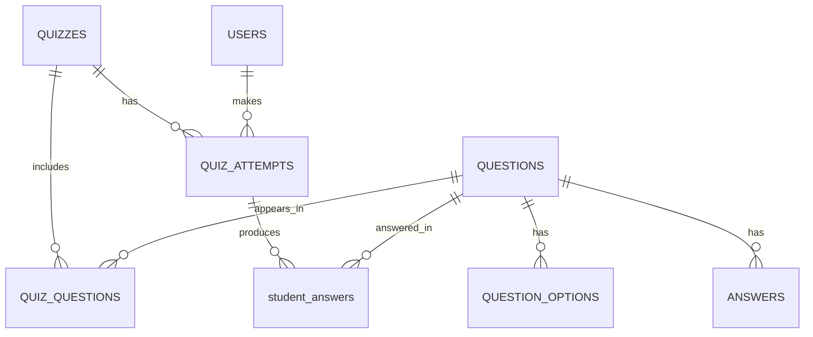
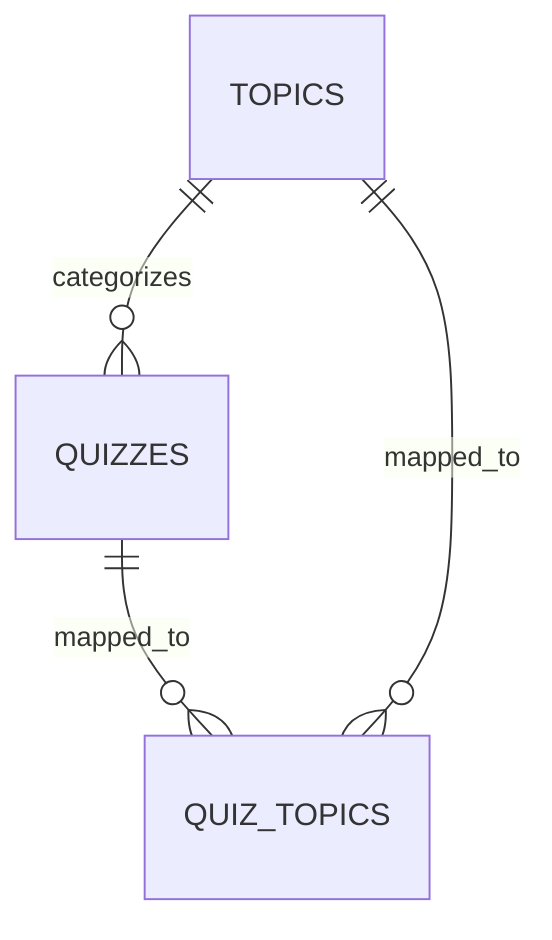
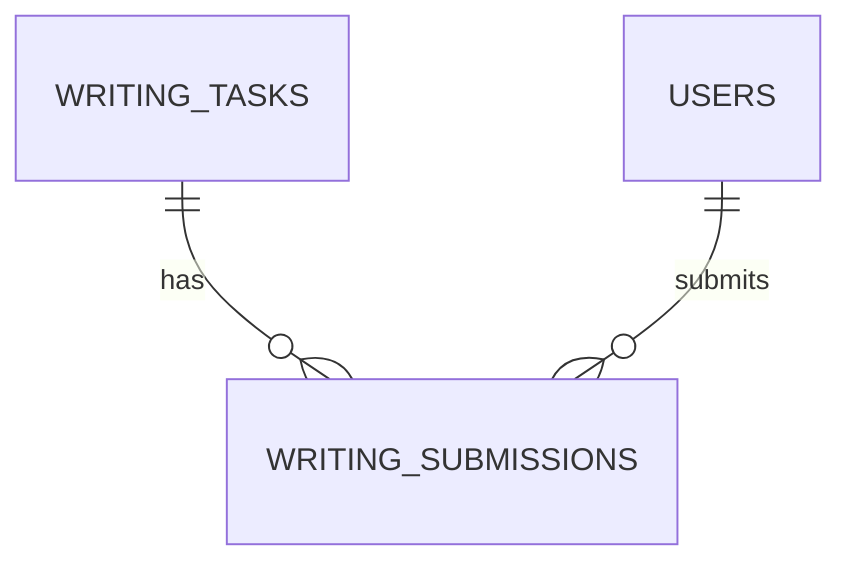
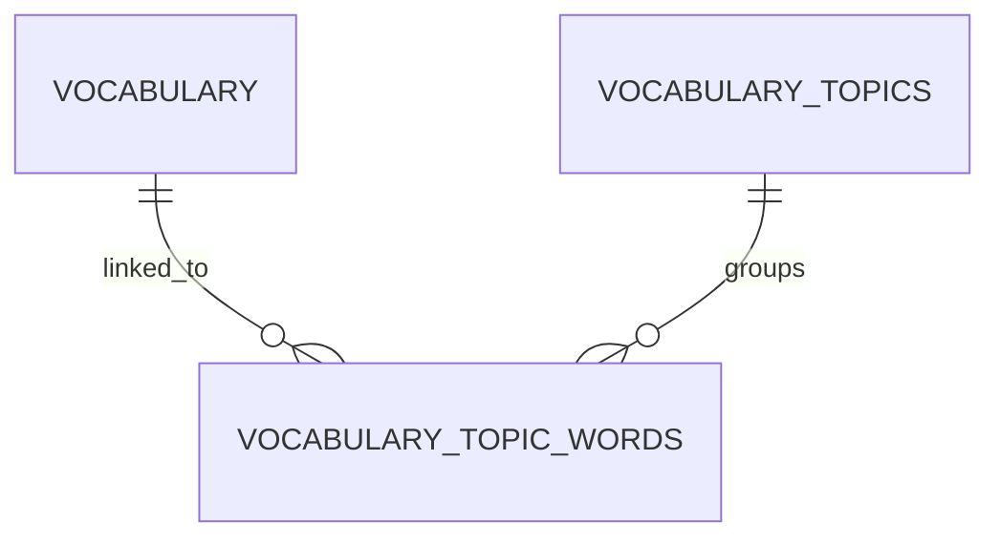
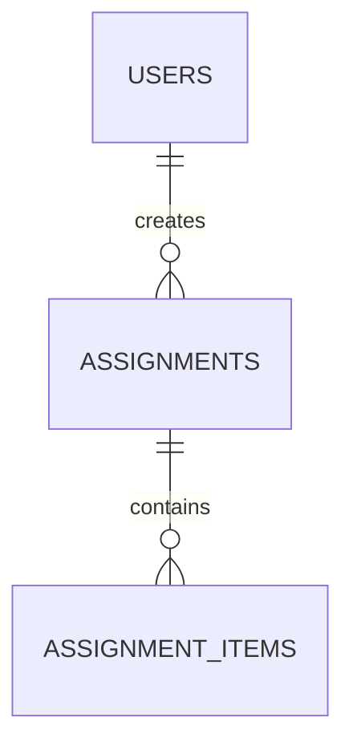
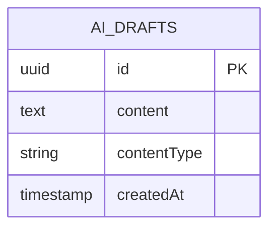

# English Student System

A full-stack English learning platform with a React frontend and a NestJS backend.

This system supports student learning workflows (reading, vocabulary, quizzes, writing) and teacher/admin workflows (content creation, management, and AI-assisted quiz generation).

## Overview

- Frontend: React 19 + TypeScript + Vite
- Backend: NestJS 11 + TypeScript + PostgreSQL
- Background jobs: BullMQ + Redis
- AI quiz generation: LangChain + Claude (Anthropic)
- Text-to-speech: ElevenLabs (`eleven_flash_v2_5` model)
- Auth: JWT stored in HTTP-only cookies
- Data fetching: TanStack Query
- Error monitoring: Sentry (frontend + backend)
- Email: Nodemailer (Gmail service)

## Repository Structure

```text
english-student-system/
├─ backend/    # NestJS API
├─ frontend/   # React web app
└─ LICENSE
```

## Directory Deep Dive

### Backend (`backend/`)

- `src/` contains all NestJS domain modules.
- `src/config/` contains Postgres, Sentry, and Nodemailer setup.
- `src/config/redis.client.ts` provides shared Redis cache access and cache invalidation helpers.
- `src/modules/llm/` contains LLM integration and quiz generation pipelines.
- `src/modules/texttospeech/` contains ElevenLabs TTS integration.
- `src/modules/ai-drafts/` stores LLM-generated quiz payloads and exposes teacher-facing management endpoints.
- `src/*/sql/*.sql` stores raw SQL files retrieved at runtime via `this.pgService.getSql()` from a pre-warmed in-memory cache.
- `src/workers/processors/quiz/` contains BullMQ job processors for `generate-quiz` and `publish-quiz` queues.
- `test/` contains e2e test setup.
- `certs/` contains optional DB SSL certificate assets.

### Frontend (`frontend/`)

- `src/pages/` contains route-level screens (`Admin`, `Dashboard`, `Login`, `Practice`, `Quiz`, `QuizList`, `Reading`, `Vocab`).
- `src/components/` contains feature UI components, including `admin/`, `quiz/`, and `layout/`.
- `src/services/` contains API services and the Axios HTTP client.
- `src/contexts/` contains auth/session context providers.
- `src/hooks/`, `src/utils/`, and `src/types/` hold shared app logic.
- `public/` contains static assets served by Vite.

## Core Product Features

### Student-facing

- Login/authenticated app shell with role-aware navigation
- Dashboard with progress/activity panels
- Reading library
- Practice center
- Vocabulary learning views
- Quiz list + quiz taking flow
- Quiz results with per-question grade cards (colored pass/fail indicators)
- Quiz attempt history with "View results" access

### Teacher/Admin-facing

- Full-width admin panel with sidebar navigation (icon + label) and mobile bottom nav bar
- Quizzes, questions, quiz builder, texts, and student progress tabs
- Student progress section: student card grid → attempt list → per-question result cards
- AI-assisted quiz generation workflow (queued job → saved to `AI_DRAFTS` table)
- AI content publish workflow (queued job)
- Content management sections for all quiz-related entities

## Backend Domain Modules

The backend is modularized by learning domain and content type:

- auth
- users
- assignments
- assignment-items
- quizzes
- questions
- question-options
- quiz-questions
- quiz-attempts
- student-answers
- answers
- texts
- writing-tasks
- writing-submissions
- vocabulary
- vocabulary-topics
- vocabulary-topic-words
- send-email
- dashboard
- llm
- ai-drafts
- texttospeech

## Data Model Overview

The schema is organized into distinct learning domains. Instead of a single dense diagram, the system is broken into focused modules for clarity.

---

### 🧠 Quiz System



Core flow:

- quiz → quiz_questions → questions
- quiz_attempts → student_answers

---

### 📚 Topics & Categorization



---

### 📝 Writing System



---

### 📖 Vocabulary System



---

### 📦 Assignments System



> ℹ️ `assignment_items` uses a polymorphic pattern (`content_type`, `content_id`) and may reference multiple content types (quizzes, texts, etc.). Both `assignments` and `assignment_items` use an `is_completed` boolean column (default `false`) instead of a `status` text column to track completion state.

---

### 🤖 AI Contents



Generated quiz payloads are stored in `AI_DRAFTS` as serialized JSON with `contentType = 'quiz'`. A separate publish step (queued job) moves them into the live quiz tables.

## Example End-to-End Flows

### How a student takes a quiz

1. Fetch available quizzes with `GET /quizzes`.
2. Load quiz content with `GET /quiz-questions/:quizId/full`.
3. Start an attempt with `POST /quiz-attempts` (includes `quizId` and `userId`).
4. Save answers during progress with `POST /student-answers` (upsert per question).
5. Submit final attempt with `POST /student-answers/submit-attempt/:attemptId`.
6. Read attempt history or latest progress with `GET /quiz-attempts?userId=...&quizId=...`.

### How a teacher creates a quiz

1. Create quiz metadata with `POST /quizzes`.
2. Create one or more question records with `POST /questions`.
3. Add valid answers with `POST /answers`.
4. Attach questions to the quiz with point weights via `POST /quiz-questions`.
5. Verify assembled payload via `GET /quiz-questions/:quizId/full`.

Teacher write operations are protected by `TeacherGuard`.

### How AI quiz generation works

1. Trigger generation with `POST /ai-drafts/generate-quiz` using `topic`, `targetLevel` (required, e.g. `"Intermediate CEFR B1"`), `multipleChoiceCount`, `openEndedCount`, and optionally `additionalInstructions`.
2. The API enqueues a BullMQ job in the `generate-quiz` queue (3 attempts, 5 s backoff).
3. The `QuizGeneratorWorker` runs the LLM quiz pipeline via `LlmService.runPipeline(quizPipeline, ...)`.
4. The pipeline builds a prompt, validates output shape/rules, and normalizes quiz questions.
5. The generated payload is serialized and saved to the `AI_DRAFTS` table via `AiContentsService.create()`.
6. A teacher can then trigger `POST /ai-drafts/:id/publish` to enqueue a `publish-quiz` job that moves the content into live quiz tables (worker implementation in progress).

### How text-to-speech works

1. POST `texttospeech/convert` with a `text` string and optional `voiceId` and `speed`.
2. The `TexttospeechService` calls the ElevenLabs API using `eleven_flash_v2_5` model.
3. The audio stream is piped directly to the client response without server-side buffering.

Default voice ID: `BtWabtumIemAotTjP5sk`. Default speed: `0.9`.

## API Surface (High-level)

Base URL in local development: `http://localhost:3000`

Primary API reference:

- Swagger/OpenAPI UI: `GET /api`

Domain route groups:

- `GET /health` - Health check
- `auth/*` - Login/register/logout/current user
- `users/*` - User operations
- `assignments/*` and `assignment-items/*`
- `quizzes/*`, `questions/*`, `question-options/*`, `quiz-questions/*`, `quiz-attempts/*`
- `student-answers/*` and `answers/*`
- `texts/*`
- `writing-tasks/*`, `writing-submissions/*`
- `vocabulary/*`, `vocabulary-topics/*`, `vocabulary-topic-words/*`
- `send-email/*`
- `dashboard/*`
- `ai-drafts/*` - AI-generated content management and quiz generation jobs
- `texttospeech/*` - Text-to-speech conversion

### API examples

Create a quiz (teacher only):

```http
POST /quizzes
Content-Type: application/json

{
    "title": "Past Simple Review",
    "description": "Mixed grammar and vocabulary"
}
```

Example response:

```json
{
  "id": "2e2fcbf3-1f6b-4a19-a2ab-8f1ba78b8880",
  "title": "Past Simple Review",
  "description": "Mixed grammar and vocabulary",
  "createdAt": "2026-03-23T11:42:10.000Z"
}
```

Start a quiz attempt:

```http
POST /quiz-attempts
Content-Type: application/json

{
    "quizId": "2e2fcbf3-1f6b-4a19-a2ab-8f1ba78b8880",
    "userId": "f58d89c7-22d6-4d4d-9db4-d3f175e9f001"
}
```

Save or update an answer during an attempt:

```http
POST /student-answers
Content-Type: application/json

{
    "attemptId": "d3ba56ea-f82e-44ce-9f15-0b738703de67",
    "questionId": "d18a51b0-b76a-4501-af61-3a9f31d4df8f",
    "answerData": {
        "value": "went"
    }
}
```

Generate a quiz with AI (teacher only):

```http
POST /ai-drafts/generate-quiz
Content-Type: application/json

{
    "topic": "Present Perfect Tense",
    "targetLevel": "Intermediate CEFR B1",
    "multipleChoiceCount": 5,
    "openEndedCount": 3,
    "additionalInstructions": "Focus on irregular verbs"
}
```

Convert text to speech:

```http
POST /texttospeech/convert
Content-Type: application/json

{
    "text": "She has lived in London for five years.",
    "speed": 0.9
}
```

Response: `audio/mpeg` binary stream (MP3, 44100 Hz, 128 kbps).

## Authentication and Session Behavior

- Login endpoint sets `access_token` cookie.
- Cookie is HTTP-only and environment-sensitive:
  - production: `secure: true`, `sameSite: none`
  - development: `secure: false`, `sameSite: lax`
- Protected backend routes use guards that verify token + role.
- Teacher-only routes are guarded by role checks.

## Authorization Model

Current behavior in the codebase:

- `student`: default role assigned on registration (`POST /auth/register`), can access authenticated student workflows.
- `teacher`: required for protected content-management endpoints guarded by `TeacherGuard` (quiz/question/answer creation and updates, AI content generation, TTS is currently unguarded).

At the frontend level:

- Authenticated route access is enforced by the protected route wrapper.
- Teachers are automatically redirected to `/admin` on login and on any unknown route.
- Student nav links (Dashboard, Reading, Practice, Vocab, Quiz) are hidden from teachers.
- The Admin nav link is only shown to teachers.
- The admin panel checks for teacher role before rendering management tabs.

If you introduce additional roles (for example a dedicated `admin` backend role), document explicit permissions per module here.

## Validation and Error Handling

Validation strategy:

- A global `ValidationPipe` is enabled with:
  - `whitelist: true`
  - `forbidNonWhitelisted: true`
  - `transform: true`
- DTOs use `class-validator` and `class-transformer` decorators for runtime request validation and type coercion.

Error handling strategy:

- Services and guards raise NestJS HTTP exceptions (for example `BadRequestException`, `UnauthorizedException`).
- The API currently relies on NestJS default exception responses (status code + message payload).
- Sentry captures runtime/server errors in both backend and frontend integrations.

## Tech Stack

### Frontend

- React 19
- TypeScript
- Vite
- React Router v7
- Axios
- TanStack Query
- Sentry React SDK

## Frontend Architecture

State and data flow:

- Server state is managed with TanStack Query (query caching, stale-time policy, retry policy).
- Session/auth state is handled by `AuthContext` using the current-user query as the source of truth.
- HTTP communication is centralized in a shared Axios client configured with `withCredentials: true`.

Routing structure:

- `react-router-dom` drives route-level page composition.
- Public route: `/login`.
- Protected routes: `/`, `/reading`, `/practice`, `/vocab`, `/quiz`, `/quiz/:quizId`, `/admin`.
- All protected routes render inside a shared app shell (`Navbar` + main content area).
- Teachers are redirected to `/admin` by a `ProtectedPage` wrapper and by the catch-all route.

Component architecture:

- `src/pages/` contains screen-level orchestration and route entry points.
- `src/components/` contains reusable feature and layout components.
  - `src/components/admin/` contains admin panel sub-components:
    - `admin-tabs.tsx` — tab definitions, icon components, and `adminTabs` array
    - `AdminSidebar.tsx` — desktop sidebar with brand header and nav items
    - `AdminMobileNav.tsx` — fixed mobile bottom navigation bar
    - `StudentProgressSection.tsx` — student card grid
    - `StudentProgressDetail.tsx` — attempt list and per-question result cards
  - `src/components/quiz/` contains quiz flow components:
    - `QuizResultsPanel.tsx` — grade badge + per-question pass/fail cards
    - `QuizRetakeScreen.tsx` — retake prompt card with styled button
    - `QuizAttemptHistoryPanel.tsx` — previous attempt list with "View results"
- `src/services/` contains API-domain service wrappers.
- `src/hooks/` contains query/mutation hooks and shared behavior.

This separation keeps UI rendering concerns, data fetching, and API communication decoupled.

### Backend

- NestJS 11
- TypeScript
- PostgreSQL (`pg` Pool)
- Redis (ioredis — persistent TCP connection for both cache and BullMQ)
- BullMQ (`@nestjs/bullmq` + `bullmq`)
- LangChain + Claude (`@langchain/anthropic`)
- ElevenLabs (`@elevenlabs/elevenlabs-js`) — text-to-speech
- class-validator / class-transformer
- Argon2 (password hashing)
- jsonwebtoken
- cookie-parser
- Nodemailer
- Sentry Node SDK

## Backend Query Architecture

- Query text is externalized into `.sql` files per module (for example: `backend/src/modules/quizzes/sql/*.sql`).
- SQL files are loaded into an in-memory cache at application startup and retrieved synchronously at runtime via `this.pgService.getSql(__dirname, fileName)`. There are no `*.queries.ts` export files — exporting queries at module-load time would crash the application before the cache is populated.
- SQL files are copied into build output via Nest CLI assets configuration (`backend/nest-cli.json`).
- This keeps service classes focused on orchestration and DTO mapping, while SQL stays versionable and readable.

## Prerequisites

- Node.js 20+
- npm 10+
- PostgreSQL database (or managed Postgres such as Supabase)
- Redis instance (persistent TCP connection via ioredis)
- ElevenLabs account with API key (for TTS)
- Anthropic API key (for quiz generation)

## Environment Configuration

Create `backend/.env` with your own values.

### Required backend variables

```env
POSTGRES_USER=your_db_user
POSTGRES_HOST=your_db_host
POSTGRES_DATABASE=your_db_name
POSTGRES_PASSWORD=your_db_password
POSTGRES_PORT=5432

JWT_SECRET=your_long_random_secret

REDIS_FULL_URL=your_redis_connection_url

ANTHROPIC_API_KEY=your_anthropic_api_key

ELEVENLABS_API_KEY=your_elevenlabs_api_key

EMAIL_USER=your_email_address
EMAIL_PASS=your_email_app_password

FRONTEND_URL=http://localhost:5173
PORT=3000
NODE_ENV=development
```

Notes:

- `FRONTEND_URL` is used by CORS and email templates.
- `REDIS_FULL_URL` is the single Redis connection URL used by both the cache layer and BullMQ queue workers.
- `ANTHROPIC_API_KEY` is used by the LLM provider for quiz generation.
- `ELEVENLABS_API_KEY` is picked up automatically by the ElevenLabs SDK from the environment.
- SSL cert support is implemented in `backend/certs/prod-ca-2021.crt` if present.
- Current frontend HTTP client logic uses:
  - development: `http://localhost:3000`
  - production: `/api` (rewritten by Vercel)

## Local Development

Install dependencies in each app:

```bash
cd backend
npm install

cd ../frontend
npm install
```

Run backend:

```bash
cd backend
npm run start:dev
```

Run frontend (new terminal):

```bash
cd frontend
npm run dev
```

Open app at: `http://localhost:5173`

## Available Scripts

### Backend scripts

- `npm run start:dev` - Start API in watch mode
- `npm run build` - Build NestJS app
- `npm run start:prod` - Run compiled output
- `npm run start:worker` - Run compiled BullMQ worker process
- `npm run lint` - Lint backend source
- `npm run test` - Unit tests
- `npm run test:e2e` - End-to-end tests

### Frontend scripts

- `npm run dev` - Start Vite dev server
- `npm run build` - Type-check + production build
- `npm run preview` - Preview production build
- `npm run lint` - Lint frontend source

## Deployment Notes

Frontend deployment is configured for Vercel:

- Requests to `/api/*` are rewritten to the deployed backend.
- All other routes are rewritten to `index.html` (SPA routing).
- Static asset caching headers are configured for long-lived immutable files.

Backend is designed to run as a standalone NestJS API (`node dist/src/main.js`).

The BullMQ worker process can be run separately with `npm run start:worker` (runs `dist/src/worker.js`).

## Testing

Backend tests:

```bash
cd backend
npm run test
npm run test:e2e
```

Frontend currently has lint/build validation via npm scripts.

## Security Recommendations

- Never commit real secrets in `.env` files.
- Rotate any credentials that were previously committed or shared.
- Use distinct credentials per environment (development/staging/production).
- Consider adding:
  - `backend/.env.example` with placeholder values
  - secret scanning in CI
- The `POST /texttospeech/convert` endpoint is currently unguarded — consider adding `AuthGuard` or `TeacherGuard` before deploying to production.

## Troubleshooting

- CORS/auth cookie issues:
  - ensure `FRONTEND_URL` matches your active frontend origin
  - ensure frontend requests use `withCredentials: true`
- Database connection issues:
  - verify Postgres host/port/SSL cert and credentials
- Redis/queue issues:
  - verify `REDIS_FULL_URL`
- LLM generation issues:
  - verify `ANTHROPIC_API_KEY` and outbound network access
- TTS issues:
  - verify `ELEVENLABS_API_KEY` is set and the account has available credits
- Login token issues:
  - verify `JWT_SECRET` is set and consistent

## License

This repository includes an MIT license file at `LICENSE`.
